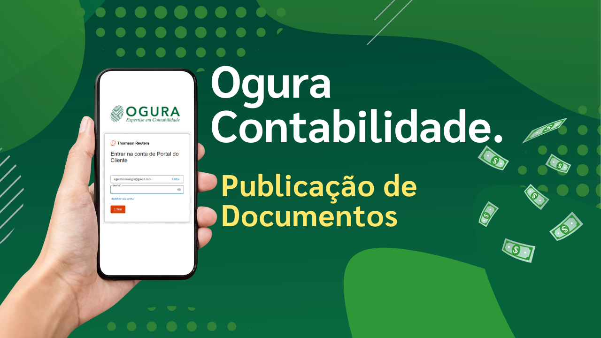
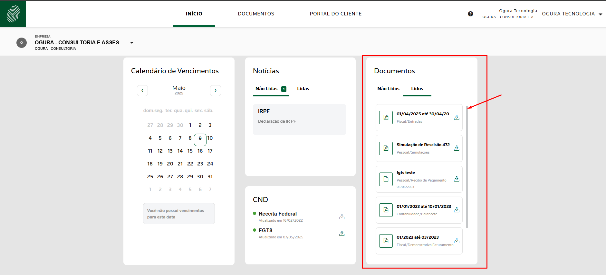
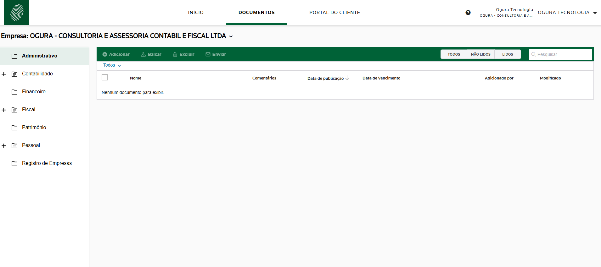
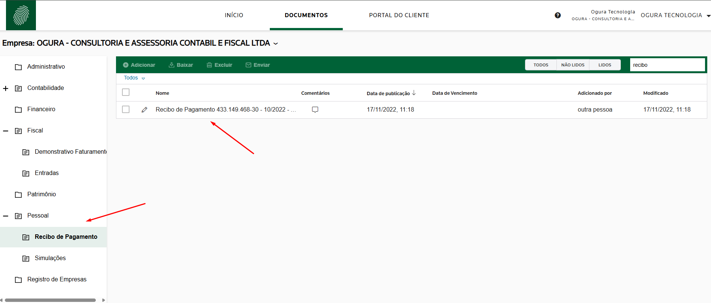
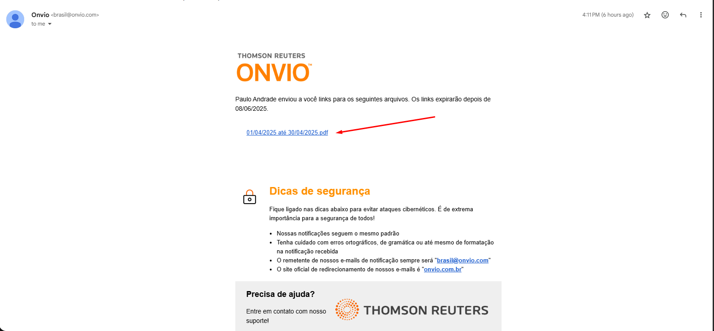

No Portal do Cliente, todos os seus documentos ficam armazenados com segurança 
na nuvem, permitindo acesso a qualquer hora e de qualquer lugar. Os arquivos 
publicados pelo nosso escritório são organizados por departamento e assunto, 
facilitando a navegação.

Assim, você encontra tudo em um só lugar: recibos, holerites, 
guias de pagamento, balanços, balancetes e demonstrativos de faturamento — 
tudo de forma prática e simples.

A seguir, apresentamos um vídeo e um manual explicando como visualizar seus 
documentos no portal.:rocket:

## Vídeo de como visualizar os documentos publicados :page_with_curl:

  
▶️ Documentos Portal do Cliente

  <iframe
    width="100%"
    height="360"
    src="https://www.youtube.com/embed/sH2ThER8RxI"
    title="App Portal do Cliente"
    frameborder="0"
    allow="accelerometer; autoplay; clipboard-write; encrypted-media; gyroscope; picture-in-picture"
    allowfullscreen
  ></iframe>

## Abaixo está o passo a passo de como acessar seus documentos.

Na página principal do aplicativo, você verá um quadro chamado **Documentos**, 
onde são exibidos os arquivos recentemente publicados pelo escritório para o 
cliente.

Na aba **Não lidos**, estão os arquivos que ainda não foram acessados 
(ou seja, não foram abertos pelo cliente).

Na aba **Lidos**, estão os documentos recentemente publicados que o 
cliente já visualizou.

Ao clicar em qualquer documento, o download será realizado automaticamente.

## Menun Principal - Documentos.

Ao clicar no menu superior **DOCUMENTOS**, o sistema abrirá a página onde os 
arquivos são salvos e organizados por departamento e assunto. 

Todos os documentos ficam armazenados na nuvem e podem ser baixados a 
qualquer hora e de qualquer lugar.

## Organização dos Documentos por Departamento e assunto.

Observe que, ao clicar em cada departamento, as subpastas são exibidas 
automaticamente, facilitando a localização dos documentos que 
você está procurando.

O sistema organiza os arquivos de forma automática e estruturada.

Por exemplo, se você deseja acessar um Recibo de Pagamento, 
basta navegar até a pasta:
**PESSOAL / Recibo de Pagamento**.

## Como realizar o download de um documento.

Sempre que o escritório publica um novo documento, o sistema envia 
automaticamente um e-mail para o cliente com o link de acesso ao arquivo.

Assim, você pode visualizar ou baixar o documento 
sem precisar abrir o aplicativo do Portal do Cliente.

## Realizar download do documento por email (link).

## 📞 Entre em Contato Conosco

Tem alguma dúvida, sugestão ou precisa de suporte?
Nossa equipe está pronta para ajudar você!

**Canais de atendimento:**

| 📧 E-mail         | ogura@ogura.srv.br                     |
|------------------|---------------------------------------- |
| 📱 WhatsApp       | (11) 3205-0503                        |
| ☎️ Telefone       | (11)  3205-0503                         |
| 🕘 Atendimento     | Segunda a Quinta, das 8h às 18h       |
| 🕘 Atendimento     | Sexta-feira, das 8h às 17h            |

Ou acesse **[Ogura Contabilidade](https://www.contabilidadeogura.com.br/)**.

