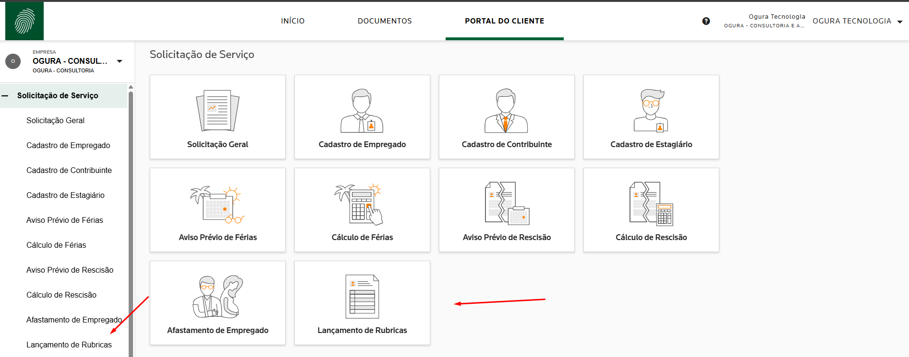
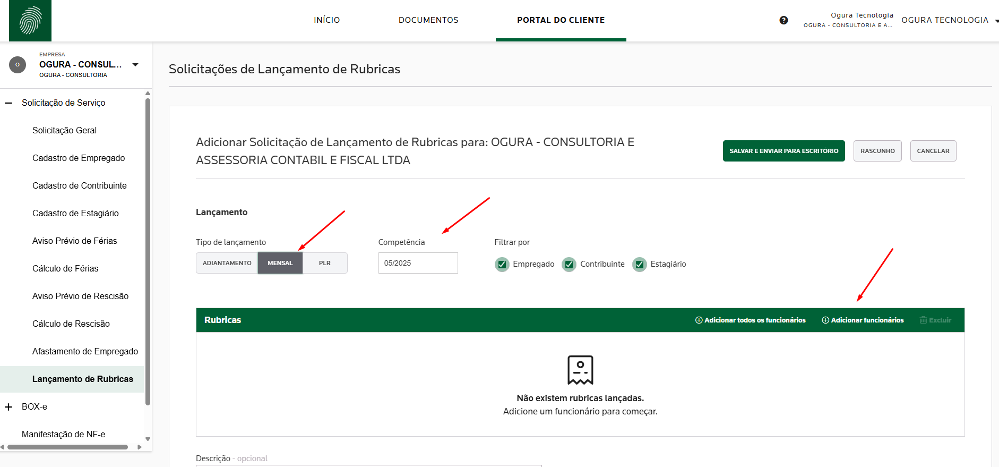
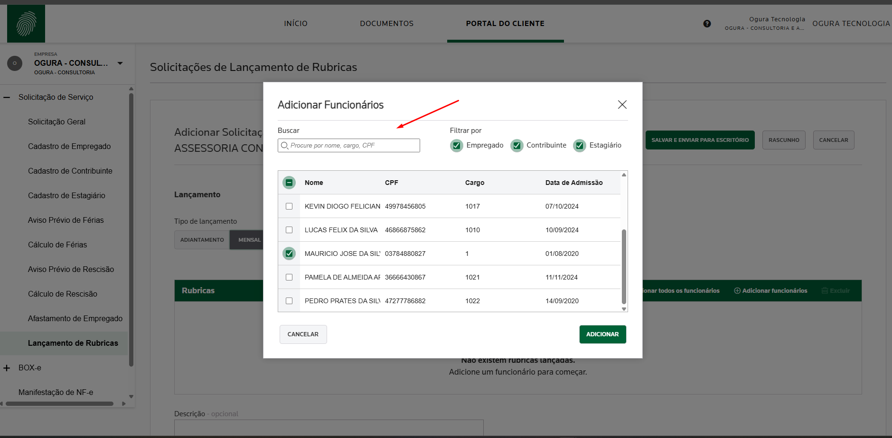
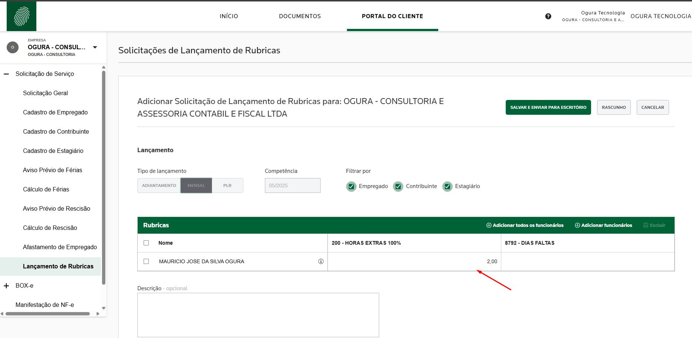
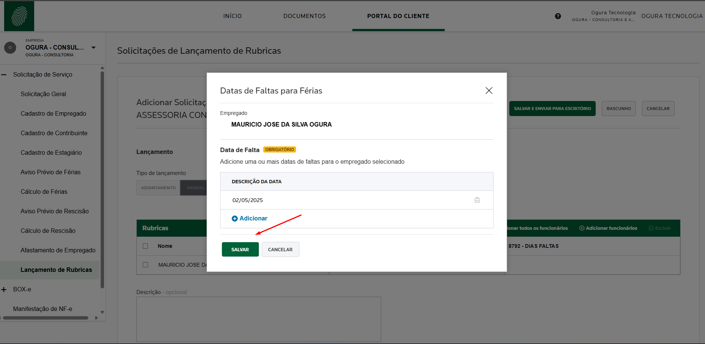
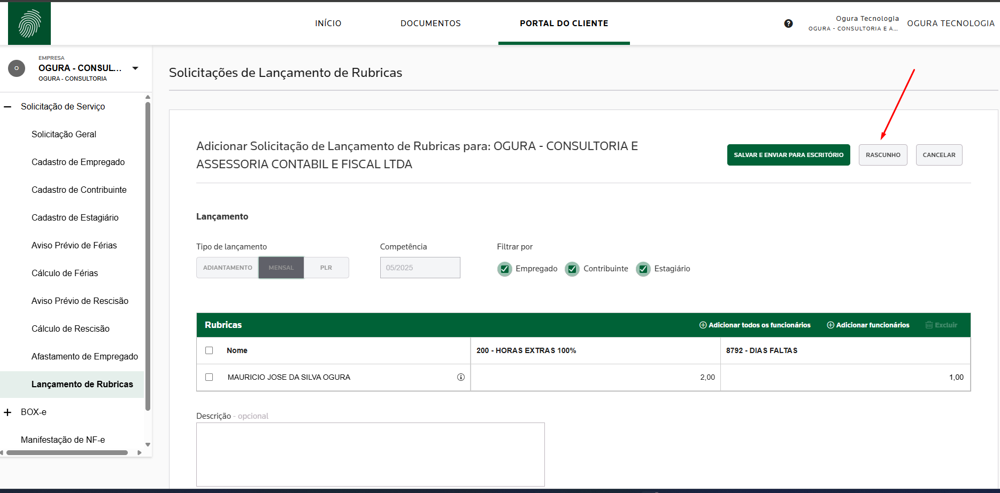
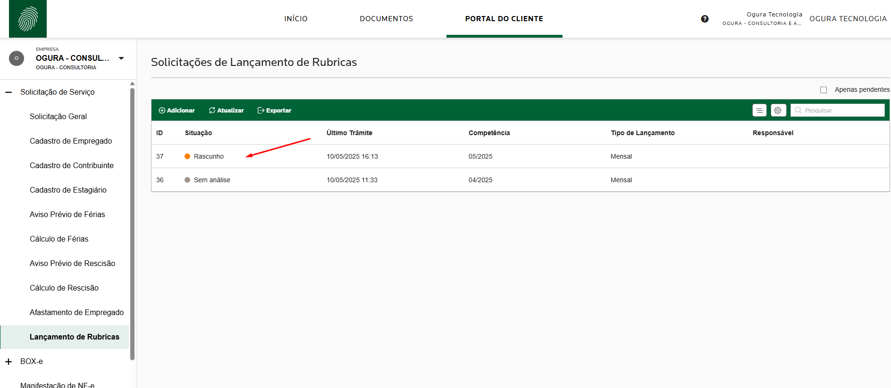
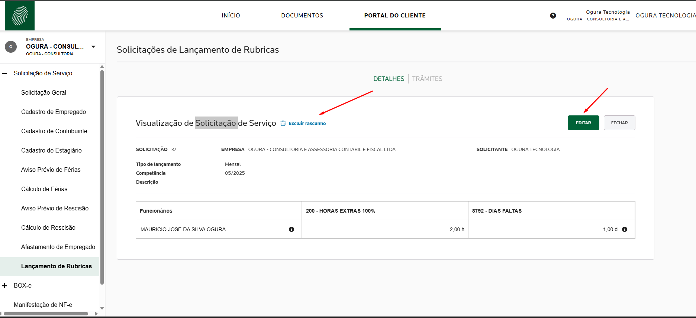
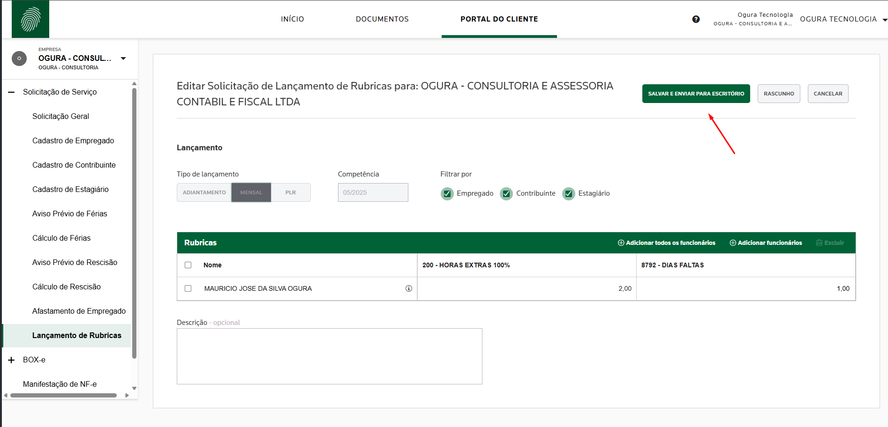

## 💼 Portal do Cliente: agilidade e segurança nos lançamentos de rubricas

Você sabia que agora é possível realizar os lançamentos de rubricas, como faltas, horas extras e outros eventos, diretamente pelo Portal do Cliente?

Essa funcionalidade foi desenvolvida para tornar a comunicação com o escritório ainda mais eficiente, moderna e segura. Por meio do portal, você consegue registrar todos os apontamentos dos seus colaboradores de forma simples, rápida e organizada, sem a necessidade de enviar planilhas ou e-mails manuais.

## ✅ Vantagens de usar o Portal do Cliente

- **Centralização das informações**: todos os lançamentos ficam armazenados em um único lugar, com histórico completo.
- **Redução de erros**: a padronização do formulário diminui as chances de falhas no envio das informações.
- **Agilidade no processo**: os dados chegam diretamente ao setor de folha de pagamento, otimizando o fechamento do mês.
- **Segurança e rastreabilidade**: você pode acompanhar o status dos lançamentos e garantir que tudo foi enviado corretamente.
- **Praticidade**: continue um rascunho salvo ou envie os dados definitivos com apenas um clique.

Além disso, caso precise de uma rubrica que não esteja habilitada, é só abrir uma Solicitação Geral dentro do próprio portal e solicitar ao nosso time.

Estamos sempre em busca de soluções que facilitem a sua rotina e tornem nossos serviços ainda mais eficientes.

💡 Já experimentou essa funcionalidade?

Acesse o  **[Portal do Cliente](https://www.contabilidadeogura.com.br/)** e conheça essa novidade!

## Video de como realizar os Lançamentos de rubricas do colaboradores

  
▶️ Assista o treinamento de como realizar os lançamentos das Rubricas para seus colaboradores

  <iframe
    width="100%"
    height="360"
    src="https://www.youtube.com/embed/l6hFpiafw3Q"
    title="App Portal do Cliente"
    frameborder="0"
    allow="accelerometer; autoplay; clipboard-write; encrypted-media; gyroscope; picture-in-picture"
    allowfullscreen
  ></iframe>

## Passo a passo de como realizar o lançamento de Rubricas

### Clique na opção "PORTAL DO CLIENTE".

### Agora clique em Lançamento de Rubricas

### Clique em ADICIONAR

### 📝 Parâmetros para o lançamento de rubricas

- **Tipo de Lançamento**: selecione sempre a opção **Mensal**.
- **Competência**: digite o **mês e o ano** referentes ao lançamento (ex: 04/2025).

#### 👥 Escolha dos funcionários

Você poderá optar por:
- **Adicionar todos os funcionários**, ou
- **Adicionar funcionários individualmente**.

Para este exemplo, vamos lançar apenas para um colaborador.  
Clique na opção **Adicionar Funcionários**.

#### 👤 Seleção do empregado

Será exibida uma lista com todos os **empregados ativos** da sua empresa.  
Selecione o colaborador para o qual deseja realizar o lançamento e clique no botão **Adicionar**.

#### ⏱️ Lançamento de horas extras

Agora, digite os valores de **hora extra** correspondentes ao empregado selecionado.

#### 📅 Lançamento de faltas

Para lançar as **faltas**, será necessário informar as **datas de ausência** do empregado.  
O sistema abrirá um formulário específico onde você poderá digitar esses valores de forma detalhada.

#### 💾 Salvar como rascunho

Após realizar os lançamentos, clique no botão **Rascunho** localizado na parte superior da tela.  
Essa opção permite que você **salve as informações temporariamente** e continue os lançamentos em outro momento.

#### 🔄 Continuar um rascunho

Para continuar um lançamento salvo como **Rascunho**, dê **dois cliques** na linha correspondente à solicitação que está com a situação **Rascunho**.  
O sistema irá reabrir o formulário com todos os dados já preenchidos, permitindo que você continue de onde parou.

#### ✏️ Editar ou excluir rascunho

Clique no botão **Editar** para continuar os lançamentos já iniciados.

⚠️ **Atenção:** tome muito cuidado com o botão **Excluir Rascunho**, pois essa opção **deleta permanentemente** todos os lançamentos feitos até o momento.

#### ✅ Finalizar lançamentos

Se você já digitou todos os lançamentos dos colaboradores e o mês já está fechado, clique no botão **SALVAR E ENVIAR PARA O ESCRITÓRIO**.  
Essa opção **finaliza os lançamentos** e os envia para o escritório realizar o cálculo da folha de pagamento.

#### 🎉 Parabéns!

Seus apontamentos foram **enviados com sucesso** para o escritório de forma rápida, simples e segura. Agora, a equipe do escritório pode prosseguir com o cálculo da folha de pagamento.

## 📞 Entre em Contato Conosco

Tem alguma dúvida, sugestão ou precisa de suporte?
Nossa equipe está pronta para ajudar você!

**Canais de atendimento:**

| 📧 E-mail         | ogura@ogura.srv.br                     |
|------------------|---------------------------------------- |
| 📱 WhatsApp       | (11) 94010-6858                        |
| ☎️ Telefone       | (11)  3205-0503                         |
| 🕘 Atendimento     | Segunda a Quinta, das 8h às 18h       |
| 🕘 Atendimento     | Sexta-feira, das 8h às 17h            |

Ou acesse **[Ogura Contabilidade](https://www.contabilidadeogura.com.br/)**.

