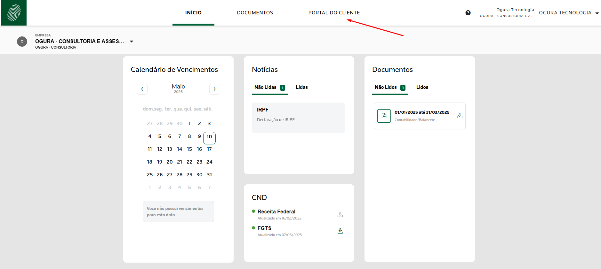
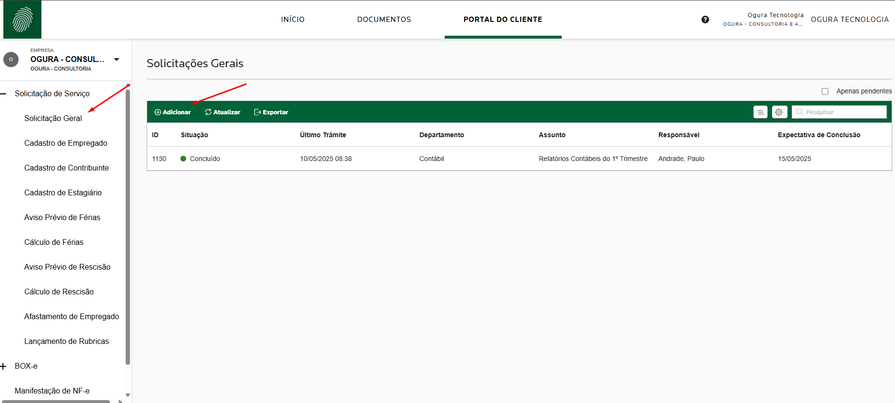
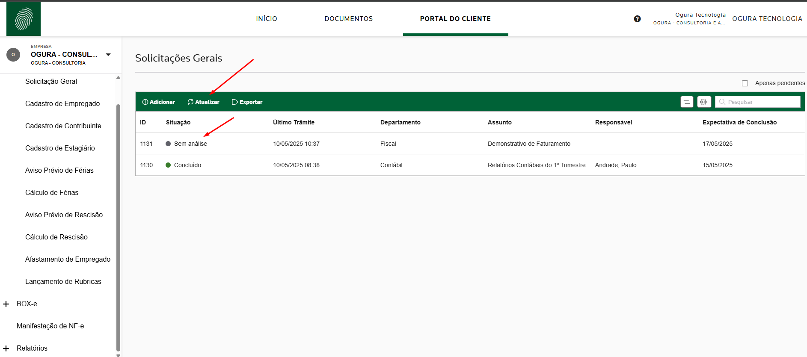
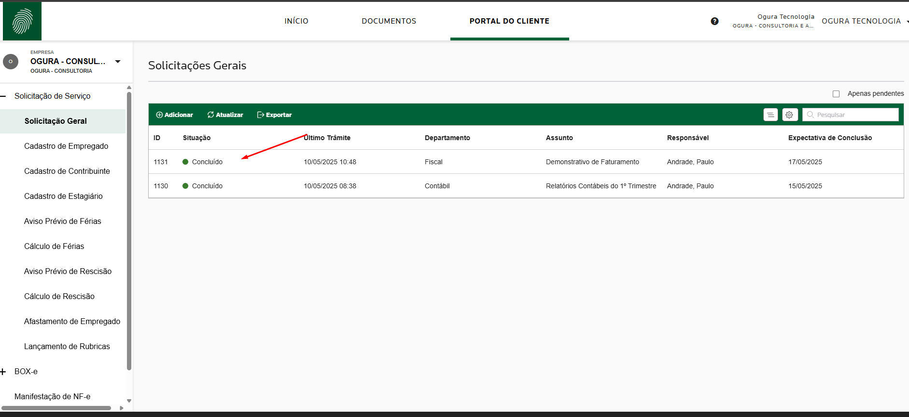
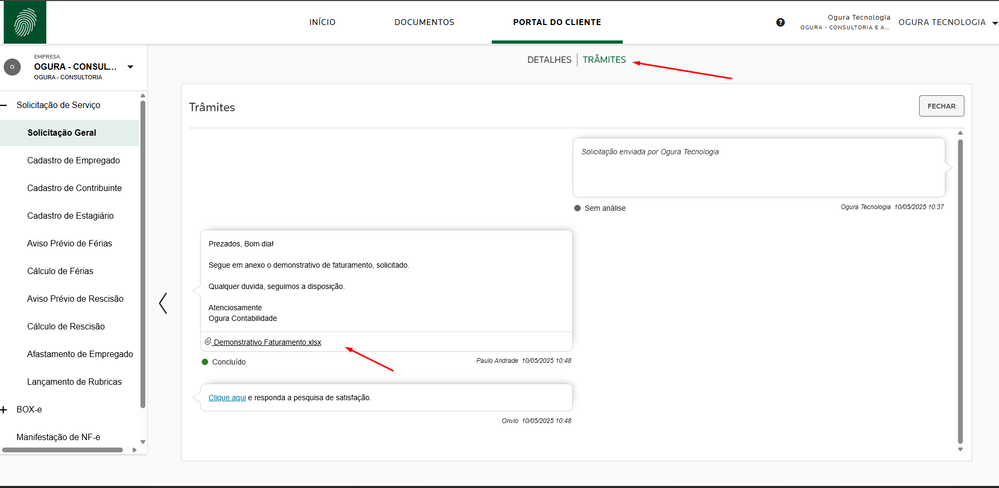

No Portal do Cliente, você pode registrar solicitações ou enviar arquivos 
diretamente para o escritório por meio da opção Solicitação Geral.

Esse formulário permite que você acompanhe todas as solicitações já resolvidas 
ou que ainda estão em análise com o nosso time.

Sempre que uma solicitação for finalizada, o sistema enviará um alerta 
automático, informando que sua solicitação foi respondida.

Dessa forma, você consegue abrir solicitações para qualquer departamento e 
sobre qualquer assunto, de forma rápida e organizada.

## Vídeo de como abrir uma solicitação para o escritório :speech_balloon:

  
▶️ Solicitações Geral no Portal do Cliente

  <iframe
    width="100%"
    height="360"
    src="https://www.youtube.com/embed/5r0nTWs4BCg"
    title="App Portal do Cliente"
    frameborder="0"
    allow="accelerometer; autoplay; clipboard-write; encrypted-media; gyroscope; picture-in-picture"
    allowfullscreen
  ></iframe>

## Abaixo está o passo a passo de como abrir uma solicitação para escritório.

Clique na opção "PORTAL DO CLIENTE".

## Abrir o menu Solicitação Geral.

Observe que o sistema apresentará diversos tipos de solicitações. No entanto, 
nosso foco está na opção "SOLICITAÇÃO GERAL". Por meio desse recurso, 
você poderá encaminhar ao escritório qualquer tipo de demanda, com a 
possibilidade de filtrar por departamento e assunto.

Clique em "Solicitação Geral".

Observe que, ao lado, será exibido um quadro com todas as solicitações já feitas ao escritório.

Clique no botão "Adicionar" para iniciar uma nova solicitação.

## Adicionar solicitações.

Ao clicar em **"Adicionar"**, o sistema abrirá um novo formulário. Nesta etapa, você deverá preencher os dados necessários para registrar a sua solicitação:

- **Departamento**  
  Selecione o departamento desejado para onde a solicitação será encaminhada.

- **Assunto**  
  Digite o assunto da sua solicitação de forma simples e clara.

- **Descrição**  
  Descreva com detalhes a sua solicitação, para que o escritório compreenda claramente a sua necessidade.

- **Expectativa de Conclusão** *(opcional)*  
  Caso queira indicar uma data esperada para retorno, utilize este campo. Ele representa a sua expectativa de resposta para a demanda.

- **Arraste um Arquivo**  
  Caso deseje anexar algum documento, você pode arrastá-lo para o campo indicado ou clicar para selecionar o arquivo.

---

Por fim, clique no botão verde **"Adicionar"**, localizado no canto superior direito da tela, para finalizar a abertura da solicitação.

## Solicitação Enviada com Sucesso.

Sua solicitação foi aberta com sucesso!

Agora, observe que o status aparece como **"Sem análise"**. Isso significa que o escritório ainda não visualizou sua solicitação.

Aguarde até receber uma notificação no aplicativo mobile ou um e-mail informando que houve uma resposta do escritório.

Você também pode abrir a aplicação e clicar no menu **"Atualizar"** para verificar se houve algum retorno.

## Solicitação Concluída

Agora, observe que sua solicitação foi **concluída com sucesso** pelo escritório.  
O status da situação foi atualizado para **Concluído**.

Clique em cima da solcitação, para ver com detalhes.

## Visualizando a Resposta do Escritório

Ao abrir os **detalhes da solicitação**, observe que na parte superior da tela há um botão chamado **"TRÂMITES"**.

Clique sobre esse botão para visualizar a **resposta do escritório**, bem como o **documento anexado**.

Para salvar ou visualizar o documento, basta **clicar sobre o arquivo**.

## 📞 Entre em Contato Conosco

Tem alguma dúvida, sugestão ou precisa de suporte?
Nossa equipe está pronta para ajudar você!

**Canais de atendimento:**

| 📧 E-mail         | ogura@ogura.srv.br                     |
|------------------|---------------------------------------- |
| 📱 WhatsApp       | (11) 3205-0503                       |
| ☎️ Telefone       | (11)  3205-0503                         |
| 🕘 Atendimento     | Segunda a Quinta, das 8h às 18h       |
| 🕘 Atendimento     | Sexta-feira, das 8h às 17h            |

Ou acesse **[Ogura Contabilidade](https://www.contabilidadeogura.com.br/)**.

